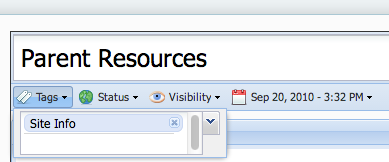

## Overview
The main navigation menu for Slate is generated by `html-templates/includes/site.menu.tpl`, but you should avoid overriding that file
unless you want to make massive changes to its layout and contents. It's best just to add links to the "Info" and "Tools" menus via the
configurable paths that the default `site.menu.tpl` file accommodates.

## Adding a single link to the Tools menu
Open your `php-config/Slate.config.php` file, or start with the default copy under `_parent`. Add a new line like the following to the
end of the file. Write the label for the link within the single quote marks on the left side, and the corresponding URL within the
single quote marks on the right side:

```language-php
Slate::$webTools['Naviance'] = 'http://www.naviance.com/';
```

## Adding a group of links to the Tools menu
To add a group of links within a submenu to the tools menu, follow the same procedure as above but use this syntax, where `District Tools` is the name of the group, and `Calendar` is one of the sub-items:

```language-php
Slate::$webTools['District Tools'] = array(
	'Calendar'                  => '/calendar',
    'Complaint Form'            => '/forms/complaint',
    'Reduced Lunch Application' => '/free-reduced-lunch'
);
```

## Add a page to the Info menu
The Info menu is populated by pages created using Slate's user-accessible content management system. Pages can be browsed and created at
`/pages` (available in the menu at Tools&nbsp;&rarr; Manage Slate&nbsp;&rarr; Pages.) These pages can be added to the Info menu by adding the tag "Site Info" from within the page editor.

