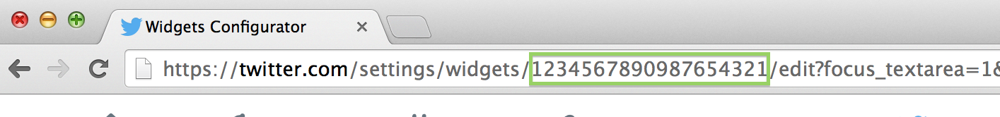

## Overview
Slate's default sidebar template in `html-templates/includes/site.sidebar.tpl` contains a Twitter widget that
can be activated by creating a widget on Twitter and inputting its settings into Slate.

## Creating the widget
Open [https://twitter.com/settings/widgets/new](https://twitter.com/settings/widgets/new), configure your widget,
and click **Create widget**

## Configuring Slate
After creating the widget, you can find the long numerical ID Twitter assigns the widget either in the URL for the
edit widget page you'll find yourself on after creating it, or in the embed code Twitter provides you to copy.

<p class="full-width" markdown="1"></p>

Append the following block to your `php-config/Slate.config.php` file, replacing the number with your widget's ID
and MY_HANDLE with your Twitter handle (excluding the @ symbol).

```language-php
Slate::$siteWidgets['twitter'] = array(
    'widgetId' => 1234567890987654321
	,'href' => 'https://twitter.com/SlateFoundation'
	,'handle' => 'SlateFoundation'
);
```