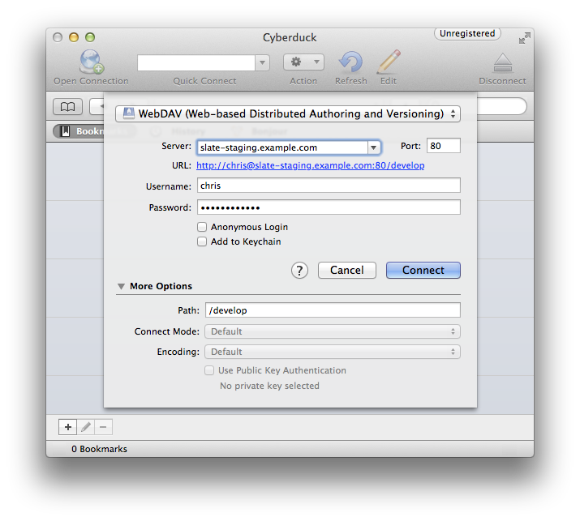

## Overview

Emergence sites have a built-in code editor you can use to customize or extend any aspect of your Slate instance, and to upload small
numbers of files into a directory on the server. Alternatively, if you need to upload/download a large number of files or transfer a
directory with a nested folder structure, you can use any file transfer application that supports the WebDAV protocol.

## Prerequisite steps
- [Create a staging site](2-slate-staging)

## Making changes to your staging site

### Using the web-based code editor
To use the web-based editor, visit <kbd>/develop</kbd> with your web browser on the site you want to edit, and log in to a user
account with Developer access (the first account you created while initializing your site was automatically granted Developer access.)
On the left side of the screen, you can explore files that are available to edit.

The `_parent` directory at the top of the list reveals a directory structure that mirrors the directory below it. This is a
special read-only directory showing files that have been *inherited* from the site's parent site and cached. You can open and edit these
files, but when you save changes to one of them, a forked copy of the file will be automatically created at an identical path outside of
the parent tree, and all changes will be redirected there.

After you close an inherited file that you've made changes to, you'll see the original file from the parent site again if you reopen it
from within the parent tree. To see your changed version, browse to the file under its new local (non-`_parent/`) path. The
filesystem that your Slate application sees and runs from is the sum of the inherited parent files and local files, with local files
overriding any inherited files with the same path and filename.

*See [&rarr;&nbsp;Changing school logo, slogan, and colors](../customization/branding)*

### Using a WebDAV file transfer application
Your site's <kbd>/develop</kbd> URL simultaneously provides both a web-based interface and a WebDAV file-transfer interface for managing 
your sites code and files. WebDAV is a file transfer protocol, like FTP and SFTP, that can be used by applications on your computer to 
access and modify a remote filesystem.

All major operating systems have built-in support for opening remote WebDAV filesystems via their default file managers, but the built
in tools for Windows and Mac&nbsp;OS&nbsp;X are relatively slow and poorly-implemented compared to third-party applications.
[Cyberduck](http://cyberduck.io/) is an open-source application for Windows and Mac&nbsp;OS&nbsp;X that provides a fast and reliable way
to manage remote files over the WebDAV protocol.

#### Connecting with Cyberduck
1. Open Cyberduck.
2. Click the **Open Connection** button at the start of the main toolbar.
3. Select **WebDAV (Web-based Distributed Authoring and Versioning)** in the first dropdown menu. *You may select **WebDAV (HTTP/SSL)** instead if you have set up an SSL certificate for this site.*
4. For **Server**, enter the hostname for your staging site, e.g. <kbd>slate-staging.example.com</kbd>.
5. Leave **Port** set to <kbd>80</kbd>.
6. Enter the username and password for your developer account.
7. Expand the **More Options** section on the bottom and enter <kbd>/develop</kbd> for **Path**.

#### Connecting with other WebDAV clients
Other WebDAV clients known to work well with Emergence include Panic's [Coda](http://panic.com/coda/) and
[Transmit](http://panic.com/transmit/) applications for Mac OS X,
and the built in **Connect to server&hellip;** functionality in Gnome Linux.

The key to connecting to your site with any WebDAV client is that you specify <kbd>/develop</kbd> somewhere in the connection setting as 
the directory you want to open (sometimes called "remote root" or "initial directory"), as any URL on your site outside of
<kbd>/develop</kbd> will not respond to WebDAV directory listing requests. The required settings in any WebDAV client will include your
site's hostname, your developer account username and password, and <kbd>/develop</kbd> as the initial/working directory.

## Next steps
- [Publishing changes to your live site](5-publish-changes)